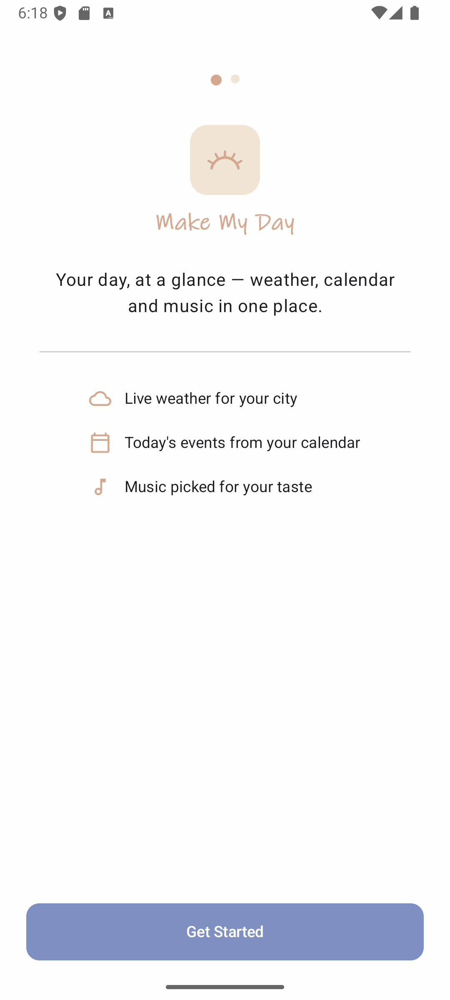
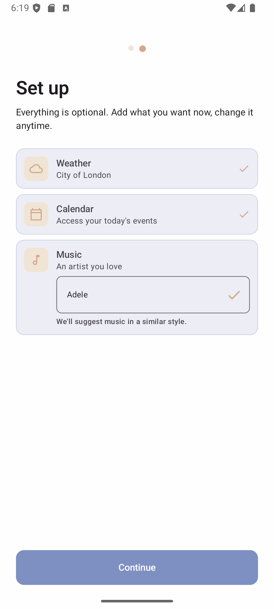
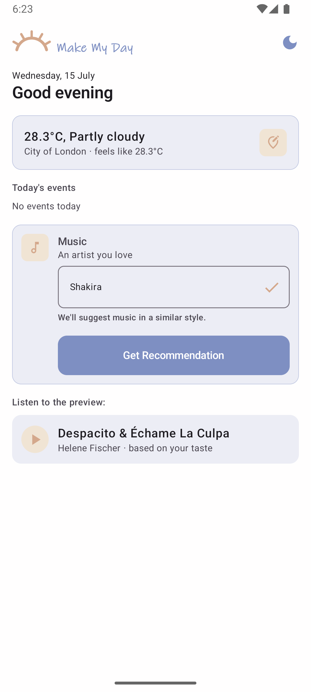
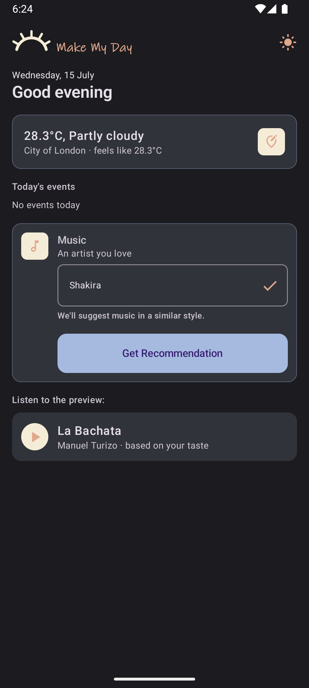

# MakeMyDay

A morning-companion Android app that shows today's weather, calendar events, and
a music recommendation — all in one glance.

A playground for building and publishing an Android SDK.

> **Download the latest APK** → [Download](https://nightly.link/fziraki/MakeMyDay/workflows/ci.yml/develop/app-debug.zip)

## Screenshots

<p float="left">
  
  
  
  
</p>

## Architecture

For more details, see [SDK vs. Library: What's the Difference — and How to Build One](https://medium.com/@fatemeh.zirakit/sdk-vs-library-whats-the-difference-and-how-to-build-one-438e3ecc313c).

```
 ┌────────────────────────────────────────────────────────────────────┐
 │                         PRESENTATION LAYER                        │
 │  ┌──────────────────────┐  ┌─────────────────────────────────┐   │
 │  │     MVI Contract     │  │         ViewModels              │   │
 │  │  ┌──────┐ ┌───────┐  │  │  ┌──────────┐ ┌──────────────┐ │   │
 │  │  │State │ │Action │  │  │  │   MyDay   │ │ SetupPage    │ │   │
 │  │  └──────┘ └───────┘  │  │  │ ViewModel │ │ ViewModel    │ │   │
 │  │                      │  │  └──────────┘ └──────────────┘ │   │
 │  │  ┌────────┐          │  │  ┌────────────────────────────┐ │   │
 │  │  │ UiState│          │  │  │ LocationSearchViewModel    │ │   │
 │  │  └────────┘          │  │  └────────────────────────────┘ │   │
 │  └──────────────────────┘  └─────────────────────────────────┘   │
 │                                                                   │
 │  ┌────────────────────────────────────────────────────────────┐   │
 │  │                    COMPOSE SCREENS                         │   │
 │  │  ┌────────────┐ ┌──────────┐ ┌────────────────────┐       │   │
 │  │  │Onboarding  │ │  MyDay   │ │  LocationSearch    │       │   │
 │  │  │  Screen    │ │  Screen  │ │     Screen         │       │   │
 │  │  └────────────┘ └──────────┘ └────────────────────┘       │   │
 │  └────────────────────────────────────────────────────────────┘   │
 └────────────────────────────────────────────────────────────────────┘
                                   │
                                   │  onAction(Action)
                                   ▼
 ┌────────────────────────────────────────────────────────────────────┐
 │                       SDK FACADE LAYER                            │
 │  ┌──────────────────────────────────────────────────────────────┐  │
 │  │                      DayKitClient                            │  │
 │  │  getMyDay() · getWeather() · getTodayEvents()                │  │
 │  │  getRecommendedTrack() · searchCity()                        │  │
 │  └──────────────────────────────────────────────────────────────┘  │
 │                                │                                   │
 │         ┌──────────────────────┼──────────────────────┐            │
 │         ▼                      ▼                      ▼            │
 │  ┌──────────────┐    ┌──────────────────┐    ┌──────────────────┐  │
 │  │ Weather      │    │ CalendarProvider │    │ MusicProvider    │  │
 │  │ Provider     │    │                  │    │                  │  │
 │  └──────────────┘    └──────────────────┘    └──────────────────┘  │
 │  ┌──────────────────────────────────────────────────────────────┐  │
 │  │              LocationProvider                                │  │
 │  └──────────────────────────────────────────────────────────────┘  │
 └────────────────────────────────────────────────────────────────────┘
                                   │
          ┌────────────────────────┼────────────────────────┐
          ▼                        ▼                        ▼
 ┌──────────────┐       ┌──────────────────┐       ┌────────────────┐
 │  Open-Meteo  │       │  ContentResolver │       │    Deezer      │
 │     API      │       │ (CalendarContract)│      │     API        │
 └──────────────┘       └──────────────────┘       └────────────────┘
 ┌────────────────────────────────────────────────────────────────────┐
 │                      DATA / EXTERNAL LAYER                        │
 │  ┌──────────────────┐  ┌──────────────────┐  ┌────────────────┐   │
 │  │  Ktor HttpClient │  │  DataStore Prefs │  │  ExoPlayer     │   │
 │  └──────────────────┘  └──────────────────┘  └────────────────┘   │
 │                                                                   │
 │  DI: Koin wires all dependencies                                  │
 │  Nav: Navigation Compose - type-safe @Serializable routes         │
 └────────────────────────────────────────────────────────────────────┘
```

## Tech Stack

| Component | Technology |
|-----------|------------|
| UI | Jetpack Compose + Material3 |
| Architecture | MVI (unidirectional data flow) |
| Navigation | Navigation Compose (type-safe routes) |
| DI | Koin |
| HTTP | Ktor Client + OkHttp engine |
| Persistence | DataStore Preferences |
| Audio | Media3 ExoPlayer |
| Serialization | Kotlinx Serialization |
| SDK distribution | GitHub Packages |

## DayKit SDK

Published as `com.github.fziraki:daykit:0.4.0`. Pluggable providers via Builder pattern:

```kotlin
val client = DayKitClient.Builder(context).build()
val summary = client.getMyDay(lat, lon, city, artist)
val city  = client.searchCity("London")
```

### Default Providers

| Provider | API | Auth |
|----------|-----|------|
| OpenMeteoWeatherProvider | Open-Meteo | Free, no key |
| DeezerMusicProvider | Deezer | Free, no key |
| NominatimLocationProvider | OSM Nominatim | Free, no key |
| AndroidCalendarProvider | ContentResolver | `READ_CALENDAR` |

## License

MIT
